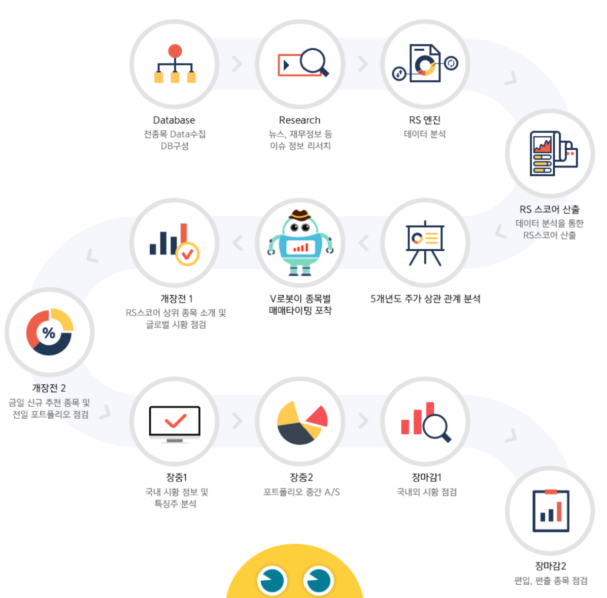
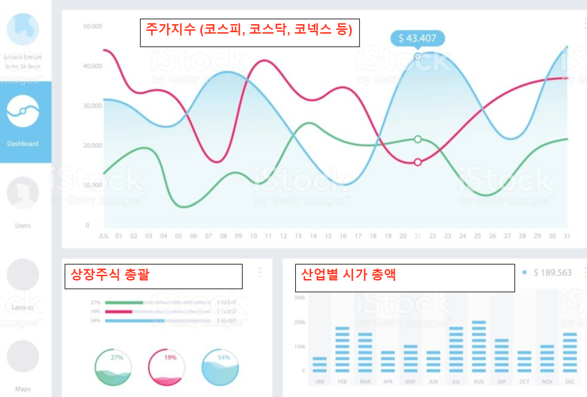

```{r setup, include=FALSE}
knitr::opts_chunk$set(echo = TRUE)

# install.packages("hrbrthemes")
# library(hrbrthemes)
```

# **이머니에서는 무엇을 하는가?** 

㈜이머니는 다우키움그룹의 계열사로서 메인 사업은 '금융투자 정보서비스'이며,  **주식 전문가 방송 엑스원**, **키움증권 HTS내 커뮤니티**, **RMS운영**, **금융데이터 분석 및 제공** 등을 사업 컨텐츠로 가지고 있다. 

<br>

# **다우키움그룹 조직도**

다우키움 그룹은 다우기술을 주축으로 하는 IT 및 금융특화 기업집단이며, 이머니는 Content&Service 계열이다. 

<p align="center">
<b>

<b>
</p>

<br>

# **제공 서비스**

현재 (주)이머니에서 제공하고 있는 서비스는 다음과 같다. 

#### - 방송을 통한 투자정보 제공

주식 전문가들이 개인방송 시스템으로 유료회원에게 다양한 증시정보를 제공하고 있다. 대형주, 급등주, 단기 마디매매, 시황예측 등의 정보를 다루고 있으며 감사후기를 보면 유료회원들의 수익인증 글도 확인할 수 있다. 

#### - 카톡을 통한 투자정보 제공

투자정보 제시 및 리딩에 특화된 전문 주식 전문가들이 회원들에게 정확하고 체계적인 정보 전달과 지속적인 소통과 상담으로, 보다 체계적인 주식종목 추천 서비스를 제공하고 있다. 무엇보다도 신속한 매수/매도 알림 뿐 만 아니라, 자세한 교육제공, 회원들의 주기적인 수익률을 공유한다. 

#### - 금융 아카데미

전문가들의 실전 노하우가 담긴 강좌 컨텐츠이다. 급등주나 상승종목을 잡아내는 방법, 선취매기법, 단기, 스윙 매매타이밍 등을 다루고 있다. 

#### - 로보스탁 

로보어드바이저를 통한 투자형태라고 볼 수 있다. 로보어드바이저란, AI 알고리즘과 빅데이터 분석을 자산운용에 접목시킨 것으로 투자성향과 목적에 따라 포트폴리오를 제공하며 투자자에게 적중률 높은 '알파' 종목을 추천하는 시스템이다. 이 때 'RS 스코어'와 머신러닝 기법이 적용된 'V로봇'이 사용되는데 각각의 개념은 다음과 같다. 

- RS 스코어는 주가 변동에 가장 중요한 5가지 팩터를 기준으로 전 종목을 랭킹화 한다. RS 스코어는 M.모멘텀, S수급, T기술적분석, F.펀더멘탙, V.거래대금으로 구성되며 펜타곤 시스템을 통해 분석된다. 

- V로봇은 과거 주가 데이터를 활용해 가격을 예측하는 통계기법을 사용한다. 상장된 전 종목의 5개년도 주가 데이터를 분석해 종목별 최적의 계수를 찾고 이를 활용하여 적정주가를 산출한다.추가적으로 종목별 매수, 매도 신호를 알려준다. 

<br>

<p align="center">
  <b> **<로보스탁의 프로세서>** </b><br>
</p>




# **데이터 자원보유 사이트**
아래 데이터 자원을 활용하여 과거 일정 기간동안의 주식종목별 추이와 주요 공시내용을 파악해보고자 한다. 

## **API 제공 홈페이지**

#### [한국예탁결제원_주식정보서비스](https://www.data.go.kr/dataset/15001145/openapi.do)

- 종목명, 종목번호, 기준일 등을 기준으로 주식기본정보, 상장정보, 주식관련사채 행사조건정보 등을 조회하는 주식정보 서비스 제공

#### [한국예탁결제원_기업정보서비스](https://www.data.go.kr/dataset/15001153/openapi.do)

- 기업정보, 주식정보, 파생결합증권정보, 대차, 금융용어정보, 국제거래정보와 관련하여 당원이 보유한 증권정보 중 공개가 가능한 정보에 대하여 제공

#### [금융감독원_공시목록 정보](https://www.data.go.kr/dataset/3075133/openapi.do)

- 공시목록(증권신고서, 사업보고서, 주요사항보고서 등 11개 분야 70개 항목)에 대한 정보 제공

#### [금융시장동향](https://www.fss.or.kr/fss/kr/openApi/detail/openApi6.jsp)

- 일별/주별 금융시장 주요 지표 등 동향 자료

#### [외국인 국내 투자동향](https://www.fss.or.kr/fss/kr/openApi/detail/openApi5.jsp)

- 월별 외국인투자자 증권매매동향

#### [금융꿀팁 200선 API](https://www.fss.or.kr/fss/kr/openApi/detail/openApi1.jsp)

- 보험, 대출 등 실용 금융정보	

<br> 

## **CSV 제공 홈페이지**

#### [한국기업 전자공시 채널](http://kind.krx.co.kr/disclosure/searchbondcorpdisclosure.do?method=searchBondCorpDisclosureMain)

- 공시자료를 Excel 파일 다운로드 가능 (유가증권, 코스닥, 코넥스, 파생상품)

#### [한국 거래소](http://marketdata.krx.co.kr/mdi#document=0301&5652b5b54b8c78c4a3ec723caac5728a=1)

- 주식시장별, 종목별, 상장사별, 순위별로 CSV 파일 다운로드 가능

# **대쉬보드 제작**

대쉬보드를 구축안은 다음과 같다. 

#### 1) 대쉬보드의 예상구도

대쉬보드의 기본틀은 아래 이미지를 참고로 할 예정.

<p align="center">
<b>

<b>
</p>

<br>

#### 2) 사용할 자료

현시점에서 일정수준 이상의 금융 분야 지식을 갖추는데 한계가 있기때문에 적합잔 자료선정에 어려움이 적지 않으므로, 대표적인 몇 가지 자료들만 제한적으로 사용할 것이다. 크게 아래와 같이 3가지로 분류하였고,  API에서는 자료를 활용하는데 한계가 있는 것으로 판단하여 자료는 csv로 준비했다.   

- **주요주가지수)** 코스닥, 코스피, KRX 시장별 주요 주가지수를 모아서 시각화할 것이며, 데이터는 2005.01 ~ 2020.01 까지 약 15년 분량의 데이터를 사용하게 될 것이다.

- **상장주총괄)** 코스피, 코스닥, 코넥스, 상장채권의 총괄 데이터를 시각화할 것이며, 데이터는 2005.01 ~ 2020.01 까지 약 15년 분량의 데이터를 사용하게 될 것이다.

- **산업별 시가총액)** 유가증권 산업별 시가총액 데이터를 시각화할 것이며,데이터는 2005.01 ~ 2020.01 까지 약 15년 분량의 데이터를 사용하게 될 것이다.

<br>

#### 3) 알고자 하는 점

데이터의 시작시점과 종료시점 사이에는 주가에 영향을 미칠만한 국제적 사건들이 있었다. 신종플루, 에볼라, 메르스, 2008년 금융 위기, 코로나 사태 등등 시기별로 증권가에 영향을 끼쳤을 것으로 판단되는 기간들을 시각화하여 증권시장에서의 등락폭의 변화나 평시 대비 흐름의 큰 변화가 있었는지 확인해보고자 한다. 
