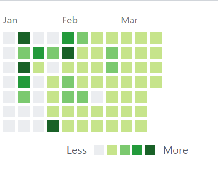

```{r setup, include=FALSE}
knitr::opts_chunk$set(echo = TRUE)
```

# 개요

이번에는 깃허브에 있는 Contribution 그래프를 R에서 반응형 그래프로 시각화해볼 것이다. 

<p align="center">
<b>

</b>
</p>
 <p align="center">
 <b>
 Github Code: [Jun4871 Github](https://github.com/Jun4871/copy_with_R_book/blob/master/Klusterling.Rmd)</b><br>
</p>


# 라이브러리 활성화

먼저 작업에 필요한 패키지들을 불러오도록 하자. 

```{r}
library(rvest)
library(tidyverse)
library(ggplot2)
library(plotly)
```

# URL 주소 할당

깃허브에 있는 주소를 캐릭터화 시켜서 객체에 할당시켜준다. 

```{r}
git_url <- "https://github.com/Jun4871"
```

# 자료 추출

함수를 사용하여 홈페이지로부터 자료를 추출한다. 각 함수의 의미는 다음과 같다. 

<br>

- read_html() : 해당 url의 html 소스코드를 가져옴
- html_nodes() : 해당 태그가 포함하고 있는 소스코드 및 속성을 추출함
- html_attr() : 해당 속성의 값을 추출함

```{r}
git_info <- git_url %>%  # git_url에 할당된 주소에 있는 노드를 html로 읽어들인 후 git_info 라는 객체에 재할당
  read_html() %>%
  html_nodes(".border.border-gray-dark.py-2.graph-before-activity-overview") %>%
  html_nodes(".js-calendar-graph.mx-3.d-flex.flex-column.flex-items-end.flex-xl-items-center.overflow-hidden.pt-1.is-graph-loading.graph-canvas.calendar-graph.height-full.text-center") %>% 
  html_nodes("g") %>% 
  html_nodes("rect")


commit_date <- git_info %>% # git_info 에서 읽어들인 노드 위에 날짜를 표시하는 태그를 가져오고 이를 날짜형으로 변형
  html_attr("data-date") %>% 
  as.Date()

commit_count <- git_info %>% # git_info 에서 읽어들인 노드 위에 날짜 수를 세는 태그를 가져오고 이를 숫자형으로 변형
  html_attr("data-count") %>% 
  as.numeric()

fill <- git_info %>% # 색상 코드를 추출 
  html_attr("fill") 


commit_info <- data.frame(commit_date,commit_count,fill) %>%  # 그래프를 그리기 위해 객체를 묶고, 커밋 수 별로 값을 지정
  mutate(level = case_when(
    fill == unique(fill)[1] ~ "E",
    fill == unique(fill)[2] ~ "D",
    fill == unique(fill)[3] ~ "C",
    fill == unique(fill)[4] ~ "B",
    TRUE ~ "A"
  ))


####

uniform_date <- 100 # 100일 간의 데이터로 제한


```

# 시각화

전처리한 데이터를 가지고 ggplot을 이용해 반응형 그래프를 생성해보았다. 

```{r}
# ggplot
git_vis <- ggplot(data = tail(commit_info,uniform_date), aes(x=commit_date,y=commit_count,fill=level)) +
  ggtitle(paste0("최근 커밋수: ", uniform_date)) +
  geom_bar(stat = "identity") +
  scale_fill_manual(values = levels(commit_info$fill)) +
  theme_bw() +
  labs(x="Date", y="Commit count")


ggplotly(git_vis)

```

